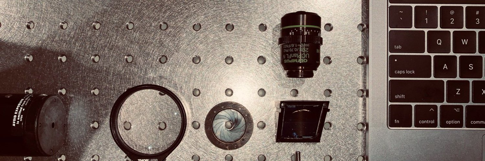
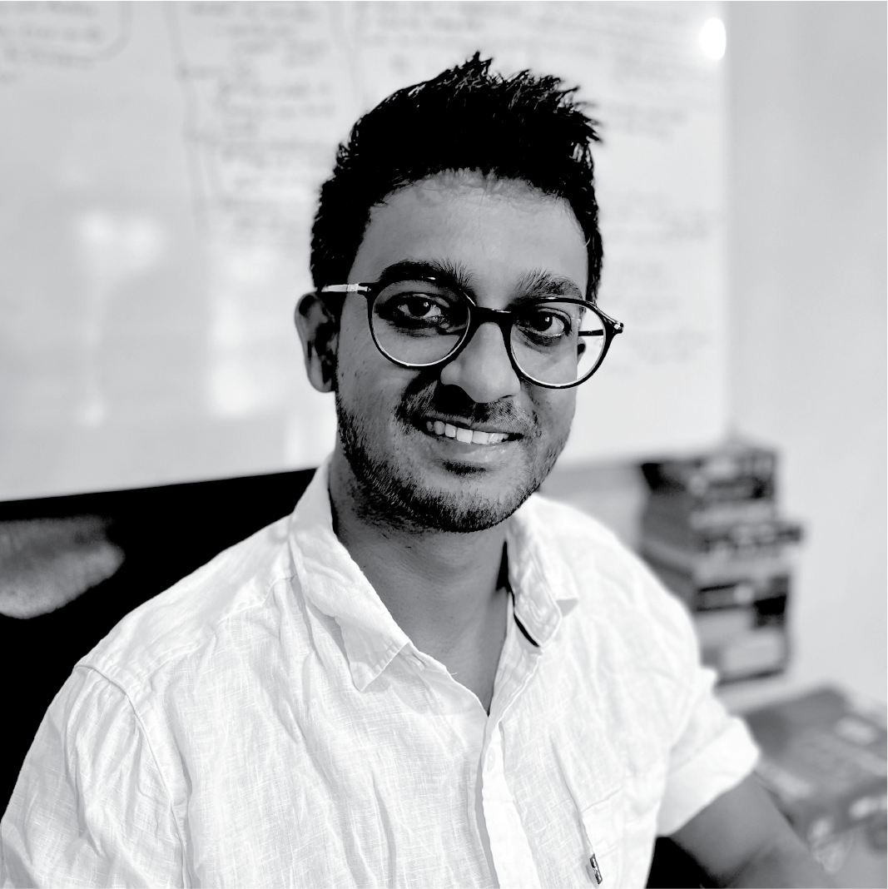
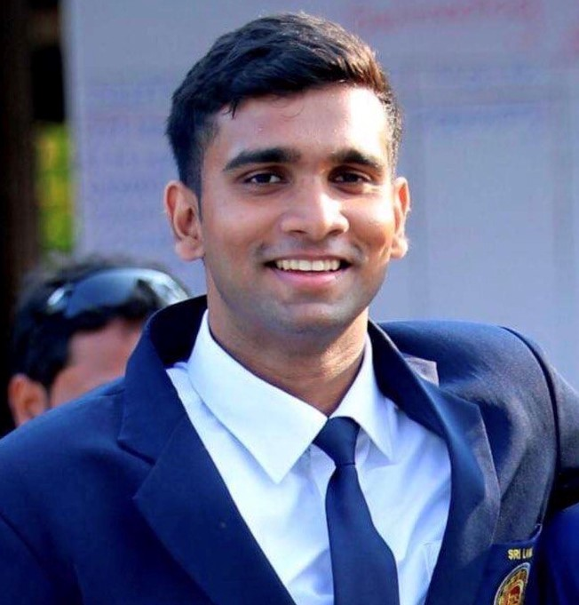

---

---
# Wadduwage-Lab

We are a research group developing **new computational microscopy technologies** through the seamless integration of **optics** and **computational algorithms**.  
Our work combines **compressive sensing**, **information theory**, and **machine learning** with **optical engineering** to design and build **next-generation instruments** that advance **biological sciences** and improve **medical practices**.

## Principal Investigator

<table>
<tr>
<td width="200">

</td>
<td>
<strong>Dushan Wadduwage</strong> 
Assistant Professor 
Department of Computer Science 
Old Dominion University, VA, USA  
<a href="https://www.linkedin.com/in/dushan-wadduwage-b496b82a/" target="_blank">LinkedIn</a> | 
<a href="https://scholar.google.com/citations?user=LHmeoN4AAAAJ&hl=en" target="_blank">Google Scholar</a>
</td>
</tr>
</table>

## Current Lab Members

<table>
<tr>
<td width="200">
 
<strong>Leonidas Zimianitis</strong> 
Ph.D. Student 
Department of Computer Science, ODU
</td>
<td width="200">
 
<strong>Dineth Jayakody</strong> 
Ph.D. Student 
Department of Computer Science, ODU
</td>
</tr>
</table>

## Research Focus Areas
- Computational microscopy  
- Compressive sensing in imaging  
- Information-theoretic approaches in optics  
- Machine learning for biomedical imaging  
- Optical system design for biological and medical applications  

---

## Alumni & Current Affiliations

<table>
<tr><td><strong>Mithunjha Anandakumar</strong></td><td>—</td></tr>
<tr><td><strong>Kithmini Herath</strong></td><td>—</td></tr>
<tr><td><strong>Ramith Hettiarachchi</strong></td><td>—</td></tr>
<tr><td><strong>Udith Haputhanthri</strong></td><td>—</td></tr>
<tr><td><strong>Vinith Kugathasan</strong></td><td>—</td></tr>
<tr><td><strong>Shehan Munasinghe</strong></td><td>—</td></tr>
<tr><td><strong>Hasindu Piyumantha</strong></td><td>—</td></tr>
<tr><td><strong>Jathurshan Pradeepkumar</strong></td><td>—</td></tr>
<tr><td><strong>David Andre Coucheron</strong></td><td>Associate Professor, University of Tromso (Former Collaborative PhD student)</td></tr>
<tr><td><strong>Ishan Baliyan</strong></td><td>Undergraduate Student, University of Waterloo (Former High School Research Intern)</td></tr>
<tr><td><strong>Liana Owen</strong></td><td>Undergraduate Student, HU ‘22 (Former Undergraduate Researcher)</td></tr>
<tr><td><strong>Navodini Wijethilake</strong></td><td>Doctoral Student, King’s College London (Former Post Graduate Researcher)</td></tr>
<tr><td><strong>Zhun Wei</strong></td><td>Assistant Professor, Zhejiang University (Former Postdoctoral Fellow)</td></tr>
</table>

---

##  Links
- **Website:** _Coming soon_  
- **Publications:** _Coming soon_  
